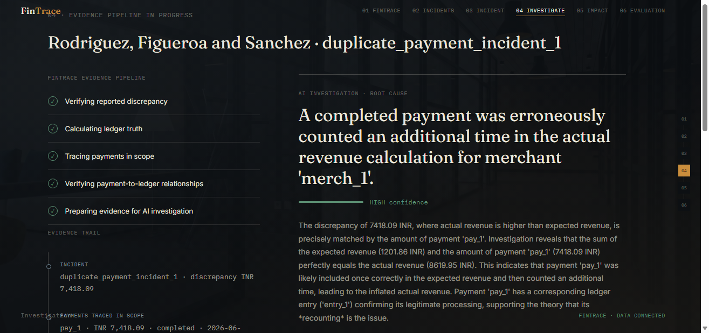

# FinTrace AI

**When financial numbers don't agree, FinTrace figures out why.**

Live demo: https://sneha-techiee.github.io/fintrace-ai/


FinTrace is an AI-powered financial incident investigation system. It detects discrepancies between a reported financial metric and independently calculated ledger truth, traces the underlying transaction evidence, uses AI to determine and explain the likely root cause, quantifies the financial impact, and recommends a bounded corrective action for human approval.

FinTrace is not a chatbot layered on top of financial data, and it is not a dashboard. The AI never calculates financial truth — a deterministic pipeline does that. The AI's job starts only once a discrepancy is already proven to exist.

Built for the **Razorpay AI Buildathon 2026 — Open Track**. FinTrace addresses a general financial operations problem: automatically investigating discrepancies between reported financial metrics and independently calculated ledger truth.

---

## Problem

A financial dashboard can report one number while the underlying transaction and ledger records imply another. When this happens, finding out why usually means manually tracing:

- payment records
- refunds
- ledger entries
- how those records were aggregated into the reported metric
- which specific transaction actually caused the gap

The hard part isn't noticing that a number is wrong — a simple comparison does that. The hard part is determining *why* it's wrong, *which* record caused it, *how much* money is affected, and *what* should reasonably be done about it, without an operator manually cross-referencing tables by hand.

FinTrace automates that investigation while keeping any actual financial remediation behind human approval.

---

## Solution — the core workflow

```
Reported financial metric
        │
        ▼
Independent ledger truth
        │
        ▼
     Reconciliation
        │
        ▼
Discrepancy detected? ──── No ──▶ Done
        │
       Yes
        │
        ▼
     Incident created
        │
        ▼
   Evidence traced
        │
        ▼
  AI investigation
        │
        ▼
Root cause + explanation + confidence
        │
        ▼
    Financial impact
        │
        ▼
   Recommended action
        │
        ▼
    Human approval
```

---

## Architecture

```
Financial data
      │
      ▼
SQLite data layer
      │
      ▼
Ledger truth calculation
      │
      ▼
Reported metric reconciliation
      │
      ▼
Incident detection
      │
      ▼
Evidence / lineage tracing
      │
      ▼
Structured investigation evidence
      │
      ▼
Gemini AI investigator
      │
      ▼
Root cause + explanation + confidence
      │
      ▼
Financial impact + recommendation
      │
      ▼
Human approval
```

**SQLite data layer** — persists merchants, payments, refunds, ledger entries, dashboard metrics, and incidents used by the local investigation pipeline. The frontend does not connect to SQLite directly; investigation results are exported to a static JSON artifact for the deployed demo.

**Ledger truth calculation** — independently recomputes what a merchant's revenue actually is, from raw ledger entries (credit for payments, debit for refunds), for a given period. This number is never taken from the dashboard.

**Reconciliation** — compares the reported dashboard metric against ledger truth. If they disagree, an `Incident` is created with the exact discrepancy amount.

**Evidence / lineage tracing** — once an incident exists, gathers the specific payments and ledger entries relevant to that merchant, currency, and time window. This evidence is scoped, not a database dump.

**Gemini AI investigator** — receives the structured, scoped evidence and reasons over it to determine the likely root cause, explain its reasoning, assign a confidence level, cite supporting evidence, and propose a bounded corrective action.

**Human approval** — the AI recommendation is surfaced to a human reviewer, who can approve the proposed action or route it to manual review. In the current prototype, approval is recorded for the browser session only, and no financial remediation is executed automatically.

---

## AI vs. deterministic pipeline

This distinction is the core engineering decision in FinTrace, and it's worth being explicit about it rather than letting "AI-powered" do the work of a vaguer claim.

**Deterministic (plain Python, no model involved):**
- generating/loading financial records
- calculating ledger truth
- calculating the discrepancy
- detecting the incident
- scoping relevant payments and ledger entries
- performing the underlying financial arithmetic
- structuring evidence for the investigator
- evaluating whether the investigator's conclusion was correct

**AI (Google Gemini 2.5 Flash):**
- determining the likely root cause from the evidence
- explaining that reasoning in plain language
- assigning a confidence level
- identifying which evidence supports the conclusion
- proposing a bounded, evidence-backed corrective action

The AI is never told the injected incident type during evaluation — that field is explicitly stripped from the prompt before it's sent. The model has to infer the cause from evidence alone, the same way a human investigator would.

Allowed root-cause categories: `duplicate_payment`, `missing_refund`, `insufficient_evidence`, `other`. The model is instructed to be conservative — if the evidence doesn't clearly support a specific cause, it reports `insufficient_evidence` rather than guessing, and the frontend requires manual review when the evidence is insufficient rather than allowing the recommendation to be approved.

---

## Evidence investigation

The AI does not receive the entire financial database. Evidence is scoped before it ever reaches the model:

```
Incident
   │
   ▼
Merchant + currency + investigation period
   │
   ▼
Relevant completed payments
   │
   ▼
Relevant ledger entries
   │
   ▼
Structured evidence
   │
   ▼
AI investigator
```

Evidence is scoped to the affected merchant, currency, investigation period, and relevant completed transactions before being passed to the model — this keeps the investigation auditable and keeps the model from having room to invent a connection that isn't in the data.

---

## Incident scenarios

The current prototype validates the investigation pipeline using two controlled, synthetic fault-injection scenarios. These are benchmark scenarios for testing the pipeline — not a claim that FinTrace only detects these two problem types.

**`duplicate_payment`** — a completed payment is artificially counted a second time in the reported metric. Reported revenue ends up higher than ledger truth by exactly that payment's amount.

**`missing_refund`** — a completed refund exists in the ledger but is not deducted from the reported metric. Reported revenue ends up higher than the correct figure by exactly the refund amount.

---

## Evaluation

Current validation result:

| Metric | Value |
|---|---|
| Completed investigation trials | 12 |
| Passed | 12 |
| Failed | 0 |
| Match rate | 100% |

Trials cover both `duplicate_payment` and `missing_refund` scenarios. A trial passes if the AI's `root_cause_category` matches the ground-truth type that was actually injected.

This is an early prototype validation signal on a small sample, not a production accuracy guarantee or a statistically conclusive result. The evaluation set will need to grow — more incident classes, larger randomized batches, and deliberately harder/ambiguous cases — before this number means more than "the core mechanism works."

---

## Human approval and safety

FinTrace does not automatically execute financial remediation. The AI produces a recommendation; a human reviews and either approves it or sends it to manual review. In the current prototype, approval is recorded for the browser session only — persistent audit-trail storage and actual remediation execution are not yet connected. No real financial change is ever made by this system.

---

## Tech stack

- **Backend / data pipeline:** Python
- **Data:** SQLite, synthetic financial records
- **AI:** Google Gemini 2.5 Flash
- **Frontend:** HTML, CSS, JavaScript (no framework)
- **Deployment:** GitHub Pages (static frontend only)

---

## Repository structure

```
fintrace-ai/
├── index.html                          # frontend, fetches fintrace_data.json
├── fintrace_data.json                  # exported investigation results
├── database.py                         # SQLite schema + seeding pipeline
├── data_gen/
│   ├── calculate_ledger_truth.py       # independent revenue calculation
│   ├── detect_incidents.py             # ledger vs. dashboard reconciliation
│   ├── lineage.py                      # scopes evidence for an incident
│   ├── investigation_evidence.py       # structures evidence for the AI
│   ├── ai_investigator.py              # calls Gemini, returns the investigation
│   ├── evaluate_investigator.py        # runs trials, measures accuracy
│   ├── export_frontend_data.py         # runs scenarios, writes fintrace_data.json
│   └── ...
├── requirements.txt
├── .gitignore
└── README.md
```

Not every file in the repository is meant to be production-grade — the files above are the ones that matter for understanding how the system works.

---

## Local setup

```bash
git clone https://github.com/sneha-techiee/fintrace-ai.git
cd fintrace-ai

python -m venv venv
# Windows: venv\Scripts\activate
# Mac/Linux: source venv/bin/activate

pip install -r requirements.txt
```

Create a `.env` file in the repo root (never commit this):

```
GEMINI_API_KEY=your_key_here
```

Run the pipeline:

```bash
python database.py                          # seeds SQLite with a synthetic financial world
python -m data_gen.evaluate_investigator     # runs investigation trials, logs results
python -m data_gen.export_frontend_data      # exports fintrace_data.json for the frontend
```

Serve the frontend locally (it fetches a JSON file, so it must be served over HTTP, not opened directly):

```bash
python -m http.server 8000
```

Then open `http://localhost:8000/index.html`.

---

## Demo flow



1. Open the incident queue — see the exported investigation queue from `fintrace_data.json`
2. Select an incident
3. Compare reported revenue against verified ledger truth
4. Start the investigation
5. Watch evidence get traced — the specific payments and ledger entries in scope
6. Inspect the AI's root cause and confidence
7. Read the supporting evidence behind the conclusion
8. View the quantified financial impact
9. Review the recommended action
10. Approve, or route to manual review
11. View evaluation results — real trial counts, not a claimed number

---

## Limitations

- Uses synthetic financial data, not a live production ledger
- Incidents are created via controlled fault injection, not real-world monitoring
- The deployed frontend is static — it replays a real, pre-computed investigation rather than triggering Gemini live
- The evaluation sample is currently small (12 trials, 2 scenario types)
- No automatic financial remediation is ever executed
- Approval and audit state are session-only; not yet persisted
- The SQLite layer and the exported frontend data are currently two independent pipelines, not yet unified into one live system

---

## Future work

- Additional incident classes beyond duplicate payments and missing refunds
- Larger, randomized evaluation batches, including deliberately ambiguous cases
- A live or streaming financial data source instead of synthetic seeding
- Persistent investigation and audit records
- Continuous/event-driven monitoring instead of on-demand batch runs
- Bounded, gated remediation integrations once the audit trail is persisted

---

## Why FinTrace

Financial monitoring tells you that a number is wrong. FinTrace is built to investigate *why* it's wrong, what evidence supports that conclusion, how much money is affected, and what should happen next — without pretending to know the answer when the evidence doesn't support one.

---

License: MIT — see [LICENSE](LICENSE).
